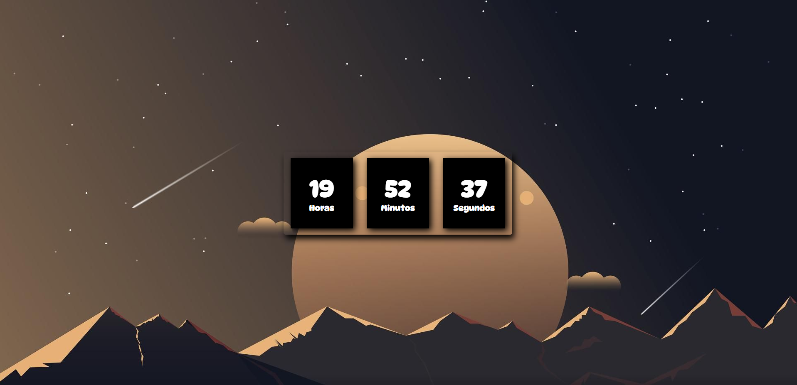

# Criação de Relógio Digital

Hoje decidir criar um Relógio Digital onde ele fica de acordo com a hora local do sistema operacional.

# Objetivo do Projeto

Me desafiei em criar um relógio digital com o objetivo de praticar mais JavaScript, e foi bastante desafiador, 
pois levei alguns dias criando esse projeto, pesquisando e buscando a melhor forma de entregar o meu código.

# Tecnologias

* JavaScript
* HTML5
* CSS3

# Imagens do Projeto

# Link para visualizar projeto

# Autor

Rodrigo Barros 

LinkedIn: https://www.linkedin.com/in/rodrigobarros2802/
